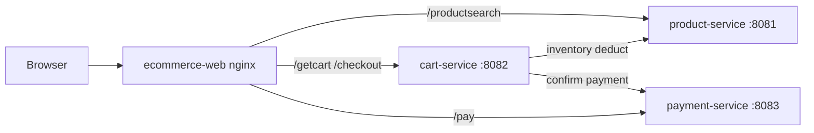

# FreshMart Ecommerce (Wallmart Lab)

A small supermarket demo built with **React 18 + Vite**, **Spring Boot 3.2 / Java 21**, and **Docker Compose**, with optional observability: **AppDynamics APM** (Docker path) or **Splunk Observability Cloud** (Kubernetes + [`o11y/`](o11y/)). The React storefront supports **Browser RUM** for either backend via `VITE_OBSERVABILITY_BACKEND`. Shopping sessions use two headers — `X-Session-Id` and `X-Session-Username` — propagated from the browser through checkout.

Deploy on **Kubernetes** with the Helm chart in [`k8s/`](k8s/) — see [Option D](#option-d--kubernetes-helm) and [`k8s/README.md`](k8s/README.md).

## Architecture

| Component | Port (default) | Role |
|-----------|----------------|------|
| **ecommerce-web** | 8080 (Docker/nginx) or 5173 (Vite dev) | React storefront |
| **product-service** | 8081 | Product catalog + inventory |
| **cart-service** | 8082 | Cart + checkout orchestration |
| **payment-service** | 8083 | Mock payment confirmation |

**Checkout flow:** browser → `POST /checkout` (cart) → `POST /internal/inventory/deduct` (product) → `POST /confirm-payment` (payment).



### nginx routing (Docker mode)

In Docker, the React SPA is served by nginx, which also reverse-proxies API calls to the backend services (see [`docker/web/nginx.conf`](docker/web/nginx.conf)):

| Path prefix | Backend |
|-------------|---------|
| `/productsearch` | product-service:8081 |
| `/getcart`, `/addproduct`, `/clearcart`, `/checkout` | cart-service:8082 |
| `/pay` | payment-service:8083 |
| `/` | React SPA (static files) |

### Observability

Two deployment paths — pick one per environment. Do not mix backends on the same stack.

| Path | Where | Java backends | Browser RUM (`ecommerce-web`) |
|------|-------|---------------|-------------------------------|
| **AppDynamics** | Docker Compose ([`docker/`](docker/), [`docker-standalone/`](docker-standalone/)) | `appdynamics/java-agent` via `JAVA_TOOL_OPTIONS` | `VITE_OBSERVABILITY_BACKEND=appdynamics` |
| **Splunk o11y** | Kubernetes + [`o11y/`](o11y/) | Splunk OTel Java agent (operator injection) | `VITE_OBSERVABILITY_BACKEND=splunk` (baked at image build) |

Frontend RUM is configured at **Vite build time** (`VITE_*` env vars). Rebuild the web image after changing RUM settings.

| Guide | Backend |
|-------|---------|
| [`docs/deploy-appd-and-o11y.md`](docs/deploy-appd-and-o11y.md) | Short runbook: build images + start with AppD or Splunk o11y |
| [`docs/instrument-react-appdynamics-browser-rum-vite-programmatic.md`](docs/instrument-react-appdynamics-browser-rum-vite-programmatic.md) | AppDynamics Browser RUM |
| [`docs/instrument-react-splunk-rum-vite.md`](docs/instrument-react-splunk-rum-vite.md) | Splunk Browser RUM |
| [`o11y/README.md`](o11y/README.md) | Splunk OTel Collector + Java auto-instrumentation (K8s) |

### AppDynamics (Docker path)

All JVM services mount a shared volume seeded by the `splunk-java-agent` sidecar (`appdynamics/java-agent:26.4.0`). Each service sets `JAVA_TOOL_OPTIONS` with the Java agent and controller credentials from `docker/.env`.

Both [`docker/docker-compose.yml`](docker/docker-compose.yml) and [`docker-standalone/docker-compose.yml`](docker-standalone/docker-compose.yml) also run:

| Agent | Image | Fixed hostname | Identity in Controller |
|-------|-------|----------------|------------------------|
| **db-agent** | `appdynamics/db-agent:26.4.0-5606` (`linux/amd64`) | `sqldbsales` | Database agent **`SQLDBSales`** |
| **machine-agent** | `appdynamics/machine-agent:26.4.0-root` | `wallmart-docker-host` | SIM / Docker infra monitoring |
| **sqlserver** | `mcr.microsoft.com/mssql/server:2022-latest` (`linux/amd64`) | `sqlserver` | MSSQL collector target |

Custom app images (`product-service`, `cart-service`, etc.) are built for **linux/amd64 and linux/arm64** via [`docker/scripts/build-all.sh`](docker/scripts/build-all.sh). On Apple Silicon, SQL Server and the DB agent run under amd64 emulation; JVM services can run native arm64.

#### Post-deploy: SQL Server collector (Database Visibility)

The db-agent container registers with the Controller but does **not** auto-create collectors. After `docker compose up`:

1. Confirm `wallmart-appd-db-agent` is running and agent **`SQLDBSales`** appears under **Database Agents** in the Controller.
2. Create a collector: type **Microsoft SQL Server**, agent **`SQLDBSales`**.
3. Connection: hostname **`sqlserver`**, port **`1433`**, SQL authentication, user **`sa`**, password from **`MSSQL_SA_PASSWORD`** in `.env`.
4. If SSL errors appear against SQL Server 2022, add connection property `sslProtocol=TLSv1.2`.

## Prerequisites

| Tool | Version | Used for |
|------|---------|----------|
| **Java** | 21 | Backend (Maven / Spring Boot) |
| **Maven** | 3.9+ | Backend build |
| **Node.js** | 20+ | Frontend |
| **npm** | — | Frontend deps and scripts |
| **Docker** | — | Containerized stack |
| **Docker Compose** | — | Orchestration |
| **Helm 3** | — | Kubernetes deployment ([`k8s/`](k8s/)) |
| **Kubernetes** | 1.25+ | Cluster for Option D |
| **Docker Buildx** | — | Multi-arch image builds ([`docker/scripts/build-all.sh`](docker/scripts/build-all.sh)) |
| **Playwright Chromium** | — | E2E only: `npx playwright install chromium` |

---

## Quick start

Fastest path to a running demo:

```bash
cp docker/.env.example docker/.env   # fill in APPDYNAMICS_* values
./up.sh
# open http://localhost:8080
```

---

## Option A — Run everything with Docker (recommended)

Best for a single-machine demo matching production routing (nginx → APIs).

### 1. Configure environment

Copy the template and fill in required AppDynamics credentials:

```bash
cp docker/.env.example docker/.env
```

At minimum, set:

```bash
APPDYNAMICS_CONTROLLER_HOST_NAME=your-controller.saas.appdynamics.com
APPDYNAMICS_AGENT_ACCOUNT_NAME=your-account
APPDYNAMICS_AGENT_ACCOUNT_ACCESS_KEY=your-access-key
```

Optional Browser RUM (rebuild web image after changing):

```bash
VITE_OBSERVABILITY_BACKEND=appdynamics
VITE_APPDYNAMICS_ENABLED=true
VITE_APPDYNAMICS_APP_KEY=your-eum-browser-key
```

See [`docker/.env.example`](docker/.env.example) for the full variable list (ports, image naming, Browser RUM, synthetic loop). For Browser RUM in the production web build, set `VITE_OBSERVABILITY_BACKEND` (`appdynamics` or `splunk`) and the matching `VITE_APPDYNAMICS_*` or `VITE_SPLUNK_*` keys — the web Dockerfile copies `docker/.env` as `.env.production` at build time.

### 2. Build and start

From the **repository root**:

```bash
./up.sh
```

Equivalent:

```bash
docker compose -f docker/docker-compose.yml up -d --build
```

### 3. Open the app

[http://localhost:8080](http://localhost:8080)

### 4. Helper scripts

| Script | What it runs |
|--------|--------------|
| [`up.sh`](up.sh) | `docker compose -f docker/docker-compose.yml up -d --build` |
| [`up_load.sh`](up_load.sh) | Same as `up.sh` + `--profile synthetic` (build and start E2E loop) |
| [`down.sh`](down.sh) | Stop stack and remove `wallmart-playwright-loop` container |
| [`ps.sh`](ps.sh) | Container status |
| [`logs.sh`](logs.sh) | Follow all service logs |
| [`logs_loop.sh`](logs_loop.sh) | Follow playwright-loop logs |
| [`logs_db_agent.sh`](logs_db_agent.sh) | Follow AppDynamics db-agent (`wallmart-appd-db-agent`) |
| [`logs_machine_agent.sh`](logs_machine_agent.sh) | Follow AppDynamics machine-agent (`wallmart-appd-machine-agent`) |

### 5. Synthetic E2E loop (optional)

Runs Playwright tests in a loop inside Docker. By default **4 workers** run tests **in parallel** across 8 journey specs (catalog, cart, checkout, browse, etc.), with shorter synthetic pacing than local dev.

```bash
docker compose -f docker/docker-compose.yml --profile synthetic up -d
# or build + start in one shot:
./up_load.sh
./logs_loop.sh   # follow playwright-loop logs
```

Tune in `docker/.env`:

```bash
PLAYWRIGHT_BASE_URL=http://ecommerce-web
PLAYWRIGHT_LOOP_INTERVAL_SECONDS=30
PLAYWRIGHT_WORKERS=4
PLAYWRIGHT_FULLY_PARALLEL=true
PLAYWRIGHT_SYNTHETIC_PACE_MS=500
```

Simulate Docker parallelism locally:

```bash
cd ecommerce-web
PLAYWRIGHT_WORKERS=4 PLAYWRIGHT_FULLY_PARALLEL=true PLAYWRIGHT_SYNTHETIC_PACE_MS=500 npm run test:e2e
```

Local `npm run test:e2e` without those vars stays **serial** (1 worker) with full pacing delays.

---

## Option B — Local development (hot reload frontend)

Run Spring Boot services on the host and Vite dev server with API proxy.

### 1. Build backend JARs

```bash
cd ecommerce
mvn package
# or: ./ecommerce/scripts/build.sh
```

### 2. Start the three APIs

**Three terminals:**

```bash
# Terminal 1 — product-service :8081
cd ecommerce/product-service && mvn spring-boot:run

# Terminal 2 — cart-service :8082
cd ecommerce/cart-service && mvn spring-boot:run

# Terminal 3 — payment-service :8083
cd ecommerce/payment-service && mvn spring-boot:run
```

**Or run packaged JARs:**

```bash
java -jar ecommerce/product-service/target/product-service-1.0.0-SNAPSHOT.jar
java -jar ecommerce/cart-service/target/cart-service-1.0.0-SNAPSHOT.jar
java -jar ecommerce/payment-service/target/payment-service-1.0.0-SNAPSHOT.jar
```

**Or use helper scripts** (background processes):

```bash
./ecommerce/scripts/build-and-start.sh   # mvn package + start all 3 APIs
./ecommerce/scripts/stop-all.sh            # stop background processes
```

Cart-service expects product and payment at `http://127.0.0.1:8081` and `http://127.0.0.1:8083` (see [`ecommerce/cart-service/src/main/resources/application.properties`](ecommerce/cart-service/src/main/resources/application.properties)).

### 3. Start the frontend

```bash
cd ecommerce-web
npm ci
npm run dev
```

Open [http://localhost:5173](http://localhost:5173). Vite proxies API paths to the correct backend ports (see [`ecommerce-web/vite.config.ts`](ecommerce-web/vite.config.ts)).

### 4. Optional — Browser RUM in dev

```bash
cp ecommerce-web/.env.example ecommerce-web/.env.local
# AppDynamics: VITE_OBSERVABILITY_BACKEND=appdynamics + VITE_APPDYNAMICS_APP_KEY=...
# Splunk o11y: VITE_OBSERVABILITY_BACKEND=splunk + VITE_SPLUNK_REALM + VITE_SPLUNK_RUM_ACCESS_TOKEN
```

See [`docs/instrument-react-splunk-rum-vite.md`](docs/instrument-react-splunk-rum-vite.md) for Splunk RUM setup. For AppDynamics, see [`docs/instrument-react-appdynamics-browser-rum-vite-programmatic.md`](docs/instrument-react-appdynamics-browser-rum-vite-programmatic.md).

Restart `npm run dev` after changing env files.

---

## Option C — Deploy pre-built images (no compile on server)

Use [`docker-standalone/`](docker-standalone/) on a host that only pulls images from a registry:

```bash
cd docker-standalone
cp .env.example .env
# Edit REGISTRY_PREFIX, IMAGE_TAG, AppDynamics vars
docker compose up -d
```

Open `http://<host>:8080` (or `${WEB_PORT}`).

**Differences from [`docker/`](docker/) compose:**

- No `build:` sections — images must exist as `{REGISTRY_PREFIX}/{service}:{IMAGE_TAG}`
- Supports `COMPOSE_PULL_POLICY` (default `missing`; set `never` for air-gapped hosts)

Both stacks are otherwise aligned (Java APM, db-agent **`SQLDBSales`**, machine-agent, SQL Server). Browser RUM is baked into the `ecommerce-web` image at build time — set `VITE_OBSERVABILITY_BACKEND` and matching vars in [`docker/.env`](docker/.env) before `build-push-all.sh` (standalone hosts pull the pre-built image).

**Air-gapped / offline:**

```bash
# In docker-standalone/.env:
COMPOSE_PULL_POLICY=never

docker load -i <images.tar>   # load images before up
docker compose up -d
```

**Synthetic profile:**

```bash
docker compose --profile synthetic up -d
# requires pushed image: {REGISTRY_PREFIX}/playwright-loop:{IMAGE_TAG}
```

See [`docker-standalone/README.md`](docker-standalone/README.md) for a short standalone quick reference.

---

## Option D — Kubernetes (Helm)

Deploy the core stack (SQL Server + three JVM services + nginx web) on generic Kubernetes with the [`k8s/wallmart-ecommerce/`](k8s/wallmart-ecommerce/) Helm chart. **No AppDynamics agents** in the base chart — application logging only (Phase 1). For full Splunk Observability, add [`o11y/`](o11y/) after deploy.

**Prerequisites:** Kubernetes 1.25+, Helm 3, images built/pushed (see [Building Docker images manually](#building-docker-images-manually)).

**Cloud (LoadBalancer — default):**

```bash
./k8s/install.sh --cloud
# or manually:
helm upgrade --install wallmart ./k8s/wallmart-ecommerce \
  --namespace wallmart --create-namespace \
  --set global.imageRegistry=your-registry \
  --set global.imageTag=latest \
  --set mssql.password='YourStrong!Passw0rd'

kubectl get svc ecommerce-web -n wallmart   # external IP / hostname
```

**Local cluster (kind / minikube):** use ClusterIP + port-forward:

```bash
cp k8s/wallmart-ecommerce/values-local.example.yaml k8s/wallmart-ecommerce/values-local.yaml
# edit registry + mssql.password in values-local.yaml (gitignored)

./k8s/install.sh --local
# or manually:
helm upgrade --install wallmart ./k8s/wallmart-ecommerce \
  --namespace wallmart --create-namespace \
  -f k8s/wallmart-ecommerce/values-local.yaml

kubectl port-forward svc/ecommerce-web 8080:80 -n wallmart
```

Open [http://localhost:8080](http://localhost:8080).

**Synthetic Playwright loop:**

```bash
--set synthetic.enabled=true
```

**Ingress** is disabled by default (`ingress.enabled: false`). nginx inside `ecommerce-web` proxies API paths to internal ClusterIP services — same routing as Docker ([`docker/web/nginx.conf`](docker/web/nginx.conf)).

Full install, secrets, lint/dry-run, and uninstall: [`k8s/README.md`](k8s/README.md). Plan/checklist: [`docs/kubernetes-phase2-plan.md`](docs/kubernetes-phase2-plan.md).

### Splunk Observability (K8s + o11y/)

After the app is running, install the Splunk OTel Collector and enable Java auto-instrumentation:

```bash
cp o11y/.env.example o11y/.env
# Edit SPLUNK_REALM, SPLUNK_ACCESS_TOKEN, HEC vars

./o11y/install.sh --with-redaction
./o11y/enable-java-instrumentation.sh
./o11y/verify.sh --java
```

**Browser RUM:** build `ecommerce-web` with Splunk vars before pushing/deploying:

```bash
# In docker/.env (or build env):
VITE_OBSERVABILITY_BACKEND=splunk
VITE_SPLUNK_REALM=us1
VITE_SPLUNK_RUM_ACCESS_TOKEN=...   # RUM token — not SPLUNK_ACCESS_TOKEN

docker compose -f docker/docker-compose.yml build ecommerce-web
# then push / load image and rollout restart ecommerce-web
```

See [`o11y/README.md`](o11y/README.md) and [`docs/instrument-react-splunk-rum-vite.md`](docs/instrument-react-splunk-rum-vite.md).

---

## Building Docker images manually

From the repository root:

```bash
# All services (multi-arch, loads into local Docker — requires Docker Buildx)
./docker/scripts/build-all.sh

# Build and push to registry (after docker login)
REGISTRY_PREFIX=youruser IMAGE_TAG=latest ./docker/scripts/build-push-all.sh
./docker/scripts/push-all.sh

# Scenario tags — separate AppDynamics vs Splunk o11y on Docker Hub
# Set VITE_OBSERVABILITY_BACKEND in docker/.env first, then:
./docker/scripts/build-push-scenario.sh appd              # tags: :appd
./docker/scripts/build-push-scenario.sh splunk            # tags: :splunk
./docker/scripts/build-push-scenario.sh splunk --web-only # only ecommerce-web (backends shared)

# Remove local app images before a clean rebuild
./docker/scripts/delete-all-images.sh
```

| Script | Purpose |
|--------|---------|
| [`build-all.sh`](docker/scripts/build-all.sh) | Multi-arch build, load into local Docker |
| [`build-push-all.sh`](docker/scripts/build-push-all.sh) | Build and push all images |
| [`build-push-scenario.sh`](docker/scripts/build-push-scenario.sh) | Build and push with `IMAGE_TAG=appd` or `splunk` (validates `docker/.env`) |
| [`build-web-only.sh`](docker/scripts/build-web-only.sh) | Build/push `ecommerce-web` only (after RUM env changes) |
| [`push-all.sh`](docker/scripts/push-all.sh) | Push locally tagged images |
| [`delete-all-images.sh`](docker/scripts/delete-all-images.sh) | Remove local `{REGISTRY_PREFIX}/*` app images |

**Scenario image tags** (Browser RUM is baked into `ecommerce-web`; JVM backends are the same for both):

| Tag | Deploy path | `docker/.env` |
|-----|-------------|---------------|
| `appd` | Docker Compose / [`docker-standalone/`](docker-standalone/) | `VITE_OBSERVABILITY_BACKEND=appdynamics` |
| `splunk` | Kubernetes + [`o11y/`](o11y/) | `VITE_OBSERVABILITY_BACKEND=splunk` |

Set `IMAGE_TAG=appd` or `IMAGE_TAG=splunk` in compose / `k8s/install.sh` to pull the matching images.

**Build script env overrides:**

| Variable | Default | Purpose |
|----------|---------|---------|
| `REGISTRY_PREFIX` | `leandrovo` | Image namespace |
| `IMAGE_TAG` | `latest` | Tag |
| `PLATFORMS` | `linux/amd64,linux/arm64` | Target architectures |
| `BUILDX_NAME` | `wallmart-multiarch` | Buildx builder name |

**Images produced** (from [`docker/scripts/image-list.sh`](docker/scripts/image-list.sh)):

- `{REGISTRY_PREFIX}/product-service:{IMAGE_TAG}`
- `{REGISTRY_PREFIX}/cart-service:{IMAGE_TAG}`
- `{REGISTRY_PREFIX}/payment-service:{IMAGE_TAG}`
- `{REGISTRY_PREFIX}/ecommerce-web:{IMAGE_TAG}`
- `{REGISTRY_PREFIX}/playwright-loop:{IMAGE_TAG}` (synthetic profile)

**Dockerfile pattern:** backends use multi-stage builds (Maven 3.9 + Eclipse Temurin 21 JRE); the web image uses Node 20 to build the SPA, then serves it with nginx 1.27. The web build copies [`docker/.env`](docker/.env) as `.env.production` — set `VITE_OBSERVABILITY_BACKEND` and RUM credentials there before building `ecommerce-web`.

**Build a single service via compose:**

```bash
docker compose -f docker/docker-compose.yml build ecommerce-web
```

---

## Environment variables

Canonical templates: [`docker/.env.example`](docker/.env.example) (Docker compose + RUM) and [`ecommerce-web/.env.example`](ecommerce-web/.env.example) (dev RUM).

| Variable | Required | Default | Used by |
|----------|----------|---------|---------|
| `APPDYNAMICS_CONTROLLER_HOST_NAME` | **Yes** | — | JVM, db-agent, machine-agent |
| `APPDYNAMICS_AGENT_ACCOUNT_NAME` | **Yes** | — | JVM, db-agent, machine-agent |
| `APPDYNAMICS_AGENT_ACCOUNT_ACCESS_KEY` | **Yes** | — | JVM, db-agent, machine-agent |
| `APPDYNAMICS_APPLICATION_NAME` | No | `wallmart-ecommerce` | JVM agent |
| `APPDYNAMICS_CONTROLLER_PORT` | No | `443` | All AppDynamics agents |
| `APPDYNAMICS_CONTROLLER_SSL_ENABLED` | No | `true` | All AppDynamics agents |
| `APPDYNAMICS_AGENT_TIER_NAME_*` | No | per-service tier names | JVM agent |
| `APPDYNAMICS_AGENT_NODE_NAME_*` | No | per-service node names | JVM agent |
| `MSSQL_SA_PASSWORD` | **Yes** | — | SQL Server + JVM DB access; MSSQL collector password |
| `MSSQL_PORT` | No | `1433` | Host → SQL Server |
| `APPDYNAMICS_DB_PROPERTIES` | No | telemetry enabled | db-agent (optional JVM props) |
| `APPDYNAMICS_SIM_ENABLED` | No | `true` | machine-agent |
| `APPDYNAMICS_DOCKER_ENABLED` | No | `true` | machine-agent |
| `REGISTRY_PREFIX` | No | `leandrovo` | Image names |
| `IMAGE_TAG` | No | `latest` | Image tags |
| `WEB_PORT` | No | `8080` | Host → nginx |
| `PRODUCT_PORT` | No | `8081` | Host → product |
| `CART_PORT` | No | `8082` | Host → cart |
| `PAYMENT_PORT` | No | `8083` | Host → payment |
| `WALLMART_PRODUCT_SERVICE_BASE_URL` | No | `http://product-service:8081` | cart-service |
| `WALLMART_PAYMENT_SERVICE_BASE_URL` | No | `http://payment-service:8083` | cart-service |
| `PLAYWRIGHT_BASE_URL` | No | `http://ecommerce-web` | playwright-loop |
| `PLAYWRIGHT_LOOP_INTERVAL_SECONDS` | No | `30` | playwright-loop |
| `PLAYWRIGHT_WORKERS` | No | `4` | playwright-loop (parallel browsers) |
| `PLAYWRIGHT_FULLY_PARALLEL` | No | `true` | playwright-loop |
| `PLAYWRIGHT_SYNTHETIC_PACE_MS` | No | `500` | playwright-loop (shorter sleeps) |
| `VITE_OBSERVABILITY_BACKEND` | No | legacy / `appdynamics` in docker example | Browser RUM backend: `appdynamics` \| `splunk` \| `none` |
| `VITE_APPDYNAMICS_ENABLED` | No | `false` | Legacy AppD toggle (use `VITE_OBSERVABILITY_BACKEND` instead) |
| `VITE_APPDYNAMICS_APP_KEY` | No | — | AppDynamics Browser RUM (web build) |
| `VITE_APPDYNAMICS_*` (beacon, CDN URLs) | No | SaaS defaults | AppDynamics Browser RUM (web build) |
| `VITE_SPLUNK_REALM` | No | — | Splunk Browser RUM realm (web build) |
| `VITE_SPLUNK_RUM_ACCESS_TOKEN` | No | — | Splunk RUM token (web build; not `SPLUNK_ACCESS_TOKEN`) |
| `VITE_SPLUNK_APPLICATION_NAME` | No | `ecommerce-web` | Splunk RUM app name |
| `VITE_SPLUNK_DEPLOYMENT_ENVIRONMENT` | No | `dev` | Splunk RUM environment tag |
| `VITE_SPLUNK_SPA_METRICS` | No | enabled | Splunk SPA route metrics; set `false` to disable |

**Standalone-only** (see [`docker-standalone/.env.example`](docker-standalone/.env.example)):

| Variable | Default | Purpose |
|----------|---------|---------|
| `COMPOSE_PULL_POLICY` | `missing` | `always` / `never` for air-gapped |

Fixed in compose (not overridable via `.env`): db-agent name **`SQLDBSales`**, hostnames `sqlserver`, `sqldbsales`, `wallmart-docker-host`.

---

## Tests

### Backend (JUnit / MockMvc)

```bash
cd ecommerce
mvn test
```

### Frontend production build

```bash
cd ecommerce-web
npm run build
```

### End-to-end (Playwright)

Requires the **full stack** reachable at the base URL (Docker on port 8080 by default):

```bash
cd ecommerce-web
npm ci
npx playwright install chromium
npm run test:e2e
```

Against another host:

```bash
PLAYWRIGHT_BASE_URL=http://staging.example npm run test:e2e
```

Other scripts:

```bash
npm run test:e2e:ui      # interactive UI mode
npm run test:e2e:headed  # visible browser
```

---

## Shopping session behavior

Sessions start when the **products page** (`/`) loads and end after **successful payment**.

| Field | Header | Set by |
|-------|--------|--------|
| Session ID | `X-Session-Id` | Frontend (`crypto.randomUUID()`) |
| Username | `X-Session-Username` | Frontend (random name, e.g. `brisk_otter_4821`) |

Both headers are required on every API call. They propagate through cart-service to product-service and payment-service. Carts are isolated per session ID.

---

## Demo / chaos scenarios

Use these to simulate database contention on the **`inventory`** table. While a lock is held, **product search** (`GET /productsearch`) and **checkout** (inventory deduct) may hang or slow down; cart operations are unaffected.

### Approach 1 — External sqlcmd script (no redeploy)

From the repository root, with the stack running:

```bash
chmod +x docker/scripts/demo-lock-inventory.sh
./docker/scripts/demo-lock-inventory.sh          # table lock, 60 seconds
./docker/scripts/demo-lock-inventory.sh 30 row   # row lock on product_id 1, 30 seconds
```

The script reads `MSSQL_SA_PASSWORD` from the environment or from `docker/.env` / `docker-standalone/.env`. It starts a transaction, acquires the lock, waits, then **rolls back** (no data change).

**Release early** — find and kill the blocking sqlcmd session:

```bash
docker exec -it wallmart-sqlserver /opt/mssql-tools18/bin/sqlcmd -S localhost -U sa -P "$MSSQL_SA_PASSWORD" -C -Q \
  "SELECT session_id, status FROM sys.dm_exec_sessions WHERE program_name LIKE '%sqlcmd%'"
docker exec -it wallmart-sqlserver /opt/mssql-tools18/bin/sqlcmd -S localhost -U sa -P "$MSSQL_SA_PASSWORD" -C -Q "KILL <session_id>"
```

### Approach 2 — HTTP endpoint (product-service)

Enable the demo endpoint in `docker/.env`:

```bash
WALLMART_DEMO_CHAOS_ENABLED=true
```

Rebuild/restart **product-service**, then trigger a lock:

```bash
curl -X POST "http://localhost:8081/internal/demo/db-lock/inventory?seconds=60"
curl -X POST "http://localhost:8081/internal/demo/db-lock/inventory?seconds=30&mode=row"
```

| Parameter | Default | Values |
|-----------|---------|--------|
| `seconds` | `60` | `5`–`300` |
| `mode` | `table` | `table` (exclusive table lock) or `row` (single product) |

When `WALLMART_DEMO_CHAOS_ENABLED` is `false` (default), the endpoint returns **404**. No session headers are required.

### Blocked process threshold (SQL Server config)

Enable SQL Server **blocked-process reporting** so blocking from the inventory lock demo appears in the SQL Server error log and Database Visibility. This changes an instance configuration via `sp_configure`; it does not modify table data.

#### Approach 1 — External sqlcmd script (no redeploy)

```bash
chmod +x docker/scripts/demo-blocked-process-threshold.sh
./docker/scripts/demo-blocked-process-threshold.sh 10      # enable (seconds until report)
./docker/scripts/demo-blocked-process-threshold.sh restore # disable (default)
```

#### Approach 2 — HTTP endpoint (product-service)

Requires `WALLMART_DEMO_CHAOS_ENABLED=true` (same as the lock demo):

```bash
curl -X POST "http://localhost:8081/internal/demo/db-config/blocked-process-threshold?seconds=10"
curl -X POST "http://localhost:8081/internal/demo/db-config/blocked-process-threshold/restore"
```

| Parameter | Values |
|-----------|--------|
| `seconds` | `5`–`300` (enable) |

Restore always sets the threshold to `0` (disabled).

#### Approach 3 — HTTP loop (activate / wait / restore / wait)

Runs activate and restore in an infinite loop via curl. Pair with [`demo-lock-loop.sh`](docker-standalone/demo-lock-loop.sh) for recurring blocking.

```bash
./demo-blocked-process-threshold-loop.sh              # default: active 120s, calm 60s
./demo-blocked-process-threshold-loop.sh 90 30        # active 90s, calm 30s
DEMO_THRESHOLD_SECONDS=15 ./demo-blocked-process-threshold-loop.sh
```

Same script lives at [`docker-standalone/demo-blocked-process-threshold-loop.sh`](docker-standalone/demo-blocked-process-threshold-loop.sh). Optional env: `DEMO_THRESHOLD_SECONDS`, `DEMO_ACTIVE_WAIT_SECONDS`, `DEMO_INACTIVE_WAIT_SECONDS`, `PRODUCT_PORT`.

#### Combined demo script

1. Enable threshold: `./docker/scripts/demo-blocked-process-threshold.sh 10` (or HTTP equivalent).
2. Trigger inventory lock: `./docker/scripts/demo-lock-inventory.sh 60` (or HTTP lock endpoint).
3. Browse products or checkout — requests stall; after 10 seconds SQL Server logs a blocked-process report.
4. Restore threshold: `./docker/scripts/demo-blocked-process-threshold.sh restore`.

Verify current value:

```bash
docker exec -it wallmart-sqlserver /opt/mssql-tools18/bin/sqlcmd -S localhost -U sa -P "$MSSQL_SA_PASSWORD" -C -Q \
  "SELECT name, value_in_use FROM sys.configurations WHERE name LIKE 'blocked process threshold%'"
```

### Verification (inventory lock)

1. Trigger either approach, then browse products or complete checkout — requests should stall.
2. Inspect locks: `SELECT * FROM sys.dm_tran_locks WHERE resource_associated_entity_id = OBJECT_ID('inventory')`
3. After release, flows recover without restarting services.

---

## Project layout

```
WALLMART/
├── ecommerce/                 # Maven aggregator
│   ├── session-support/       # Shared session filter + propagation
│   ├── product-service/       # :8081
│   ├── cart-service/          # :8082
│   ├── payment-service/       # :8083
│   └── scripts/               # build.sh, start-all.sh, stop-all.sh, build-and-start.sh
├── ecommerce-web/             # React + Vite SPA
├── docker/                    # Compose, Dockerfiles, nginx, scripts
│   ├── .env.example           # Env template for compose
│   └── scripts/               # build-all.sh, build-push-all.sh, push-all.sh
├── docker-standalone/         # Pull-only compose for servers
├── k8s/                       # Helm chart (Kubernetes deployment)
│   ├── README.md              # Install, LoadBalancer, local port-forward, o11y
│   └── wallmart-ecommerce/    # Chart (values.yaml, templates)
├── o11y/                      # Splunk OTel Collector (K8s observability)
│   └── README.md              # Install, Java injection, Browser RUM pairing
├── docs/                      # Phase plans, RUM instrumentation guides
├── run/                       # Separate legacy demo (stonks game) — not part of ecommerce
├── up.sh / down.sh / ps.sh / logs.sh / up_load.sh / logs_loop.sh / logs_db_agent.sh / logs_machine_agent.sh
└── README.md
```

---

## Troubleshooting

| Issue | What to try |
|-------|-------------|
| Frontend cannot reach APIs in dev | Ensure all three Spring Boot apps are running on 8081–8083 |
| `400` on API calls | Missing `X-Session-Id` or `X-Session-Username` (browser app sets both automatically) |
| Docker build fails on `npm ci` | Retry when network is stable, or build web image alone: `docker compose -f docker/docker-compose.yml build ecommerce-web` |
| JVM services fail to start in Docker | Check `APPDYNAMICS_*` values in `docker/.env` — copy from [`docker/.env.example`](docker/.env.example) if missing |
| E2E tests fail | Stack must be up at `PLAYWRIGHT_BASE_URL` (default `http://localhost:8080`) |
| Port already in use | Change `WEB_PORT` / `PRODUCT_PORT` / etc. in `docker/.env` |
| Browser RUM not appearing | Rebuild web image after changing `VITE_*` vars; confirm `VITE_OBSERVABILITY_BACKEND` matches your stack (`appdynamics` for Docker, `splunk` for K8s+o11y) |
| Splunk RUM on K8s but no sessions | Use a **RUM access token** (`VITE_SPLUNK_RUM_ACCESS_TOKEN`), not the org ingest token from `o11y/.env` |
| `docker buildx is required` | Install Docker Buildx, or use `docker compose build` for single-platform local builds |

---

## API quick reference

| Method | Path | Service |
|--------|------|---------|
| `GET` | `/productsearch` | product |
| `POST` | `/addproduct/{id}` | cart |
| `GET` | `/getcart` | cart |
| `DELETE` | `/clearcart` | cart |
| `POST` | `/checkout` | cart |
| `POST` | `/confirm-payment` | payment (called by cart, not SPA) |

All endpoints require `X-Session-Id` and `X-Session-Username` headers.
