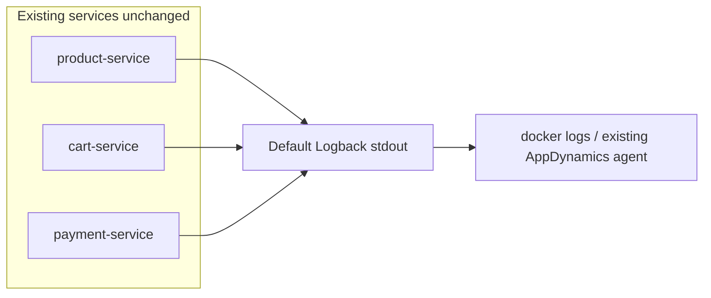

# Phase 1 — Application Logs (Default Logback Only)

Add structured SLF4J business-event logs across all ecommerce services using Spring Boot default Logback only. No new modules, no OpenTelemetry, no Docker/Collector changes, no custom logback.xml.

## Implementation checklist

- [x] Define log message conventions (`event=` prefix, key=value fields) and optional MDC pattern in `application.properties`
- [x] Add `session.*` logs in `SessionRegistry`, `SessionServletFilter`, `ProductController`, `PaymentController`
- [x] Add checkout/cart/inventory/payment logs in `CheckoutService`, `CartService`, remote clients, `JdbcProductCatalog`, `PaymentController`
- [x] Add `SimulatedPaymentDetails` generator; log fake random credit card + SSN on `payment.confirmed` and `payment.transaction.saved` (logs only, not DB)
- [x] Add WARN/ERROR logs on existing failure branches (validation, 409, payment error, compensation restore)
- [x] Align existing product-service demo lock/config log messages to the same `event=` naming convention
- [x] Add `service.started` INFO log on application ready in each service main class or `@EventListener`

---

## Scope

**In scope:** Add `org.slf4j.Logger` calls at meaningful business points in existing Java classes. Logs go to stdout via Spring Boot's **default Logback** (no new dependencies, no new Maven modules, no Docker/Compose changes, no OTel agent/collector, no JSON appenders).

**Out of scope (deferred to a later phase):**
- OpenTelemetry instrumentation or trace/log correlation
- Splunk Observability / OTLP export
- Custom `logback-spring.xml` or `logstash-logback-encoder`
- New `observability-support` module
- Demo toggles to artificially trigger payment failure (log the path when it naturally occurs via tests/mocks or future work)
- README / runbook changes (optional; skip unless requested)

## Current state

| Area | Status |
|------|--------|
| Services | [product-service](../ecommerce/product-service), [cart-service](../ecommerce/cart-service), [payment-service](../ecommerce/payment-service) |
| Logging stack | Spring Boot default Logback + SLF4J (transitive) |
| MDC today | [SessionServletFilter](../ecommerce/session-support/src/main/java/com/wallmart/session/SessionServletFilter.java) sets `sessionId`, `sessionUsername` on every non-actuator request |
| Existing logs | Only product-service demo classes ([InventoryDemoLockService](../ecommerce/product-service/src/main/java/com/wallmart/product/demo/InventoryDemoLockService.java), [SqlServerConfigDemoService](../ecommerce/product-service/src/main/java/com/wallmart/product/demo/SqlServerConfigDemoService.java), [DemoDbLockController](../ecommerce/product-service/src/main/java/com/wallmart/product/demo/DemoDbLockController.java)) |



---

## Logging conventions

Use plain SLF4J parameterized messages with a stable **`event=`** prefix so logs are grep-friendly in Splunk/AppDynamics later without changing format today.

**Pattern:**

```java
private static final Logger log = LoggerFactory.getLogger(CheckoutService.class);

log.info("event=checkout.started lineCount={} cartTotal={} clientAmount={}",
    lines.size(), serverTotal, normalized);
```

**Rules:**
- First token in message: `event=<name>` (dot-separated, lowercase)
- Additional context as `key={}` placeholders (SLF4J safe, no string concat)
- Levels: `INFO` happy path, `WARN` recoverable/validation, `ERROR` terminal/unexpected
- Rely on existing MDC — `sessionId` and `sessionUsername` appear automatically when the request passed [SessionServletFilter](../ecommerce/session-support/src/main/java/com/wallmart/session/SessionServletFilter.java)
- Do **not** log real secrets or passwords; pass exception only on `ERROR` for unexpected cases
- **Exception (demo only):** payment-service may log **simulated fake** credit card and SSN values for observability/PII-detection showcases — see [Payment simulated PII](#f-payment-simulated-pii-demo-only) below

**Optional one-line config** (per service `application.properties`, not required for Phase 1):

```properties
logging.pattern.console=%d{yyyy-MM-dd HH:mm:ss.SSS} [%thread] %-5level [sessionId=%X{sessionId}] %logger{36} - %msg%n
```

This surfaces session correlation in plain text without a custom Logback XML file.

---

## Event catalog — all demo paths

### A. Session lifecycle

| Event | Class | Trigger | Level |
|-------|-------|---------|-------|
| `session.opened` | `SessionRegistry` | `open()` creates/reactivates session | INFO |
| `session.already_completed` | `SessionRegistry` | `open()` rejects completed session | WARN |
| `session.not_active` | `SessionRegistry` | `requireActive()` on completed session | WARN |
| `session.completed` | `SessionRegistry` | `close()` | INFO |
| `session.request.rejected` | `SessionServletFilter` | Missing/blank headers | WARN |
| `catalog.browsed` | `ProductController` | After `sessionRegistry.open()` | INFO |

### B. Happy-path checkout

| Event | Class | Trigger | Level |
|-------|-------|---------|-------|
| `cart.item.added` | `CartService` | Successful add | INFO |
| `cart.viewed` | `CartService` | `getCart()` | INFO |
| `cart.cleared` | `CartService` | `clearCart()` | INFO |
| `checkout.started` | `CheckoutService` | Entry, after validation | INFO |
| `checkout.inventory.deduct.requested` | `CheckoutService` / `HttpProductInventoryApi` | Before deduct call | INFO |
| `inventory.deducted` | `JdbcProductCatalog` | After successful deduct loop | INFO |
| `checkout.payment.requested` | `CheckoutService` / `HttpPaymentConfirmationApi` | Before confirm call | INFO |
| `payment.confirmed` | `PaymentController` | Successful confirm | INFO |
| `payment.transaction.saved` | `PaymentController` | After JDBC save | INFO |
| `checkout.completed` | `CheckoutService` | Before return | INFO |

### F. Payment simulated PII (demo only)

On each `/pay` and `/confirm-payment`, generate **random fake** payment identity details and include them in log messages. This is intentional demo data for Splunk/AppDynamics PII-detection showcases — **not** real customer data and **not** persisted to the database.

**New class:** `SimulatedPaymentDetails` in payment-service (package `com.wallmart.payment.demo` or `com.wallmart.payment.sim`)

| Field | Generation rule | Example |
|-------|-----------------|---------|
| `creditCardNumber` | Random 16-digit string with valid test BIN prefixes (`4111`, `5500`, `3782`) | `4111283746291847` |
| `creditCardLast4` | Last 4 of generated number | `1847` |
| `creditCardBrand` | Derived from BIN | `visa`, `mastercard`, `amex` |
| `socialSecurityNumber` | Random `###-##-####` using **900-00-0000–900-99-9999** range (invalid/test SSN block) | `900-47-3821` |
| `simulated` | Always `true` in logs | `simulated=true` |

**Implementation sketch:**

```java
public final class SimulatedPaymentDetails {
  public static SimulatedPaymentDetails random() { ... }

  public String creditCardNumber() { ... }
  public String socialSecurityNumber() { ... }
}
```

Use `java.util.concurrent.ThreadLocalRandom` — no new Maven dependencies.

**Where to log** ([PaymentController](../ecommerce/payment-service/src/main/java/com/wallmart/payment/web/PaymentController.java)):

```java
SimulatedPaymentDetails pii = SimulatedPaymentDetails.random();

log.info(
    "event=payment.confirmed simulated=true amount={} status={} creditCardNumber={} creditCardBrand={} ssn={}",
    request.value(), response.status(),
    pii.creditCardNumber(), pii.creditCardBrand(), pii.socialSecurityNumber());

log.info(
    "event=payment.transaction.saved simulated=true amount={} creditCardNumber={} ssn={} sessionId={}",
    request.value(), pii.creditCardNumber(), pii.socialSecurityNumber(), session.sessionId());
```

**What stays unchanged:**
- [PaymentTransactionRepository.save](../ecommerce/payment-service/src/main/java/com/wallmart/payment/repository/PaymentTransactionRepository.java) continues storing only `session_id`, `username`, `amount`, `status`, `message` — **no** card/SSN in SQL Server
- API response body unchanged (`PayResponse` stays `status` + `message` only)
- Same simulated values used for both `/pay` and `/confirm-payment` within a single request handler call

**Example log line:**

```
event=payment.confirmed simulated=true amount=12.98 status=success creditCardNumber=5500832145678901 creditCardBrand=mastercard ssn=900-47-3821
```

### C. Failure / compensation (existing code paths only)

| Event | Class | Trigger | Level |
|-------|-------|---------|-------|
| `cart.item.unknown` | `CartService` | Unknown product id | WARN |
| `checkout.validation.failed` | `CheckoutService` | Empty cart, null amount, amount mismatch | WARN |
| `inventory.deduct.conflict` | `JdbcProductCatalog` | `InsufficientStockException` | WARN |
| `checkout.inventory.deduct.failed` | `HttpProductInventoryApi` | Non-409 HTTP errors | WARN |
| `checkout.payment.failed` | `HttpPaymentConfirmationApi` | RestClient failure | ERROR |
| `checkout.compensating.inventory.restore` | `CheckoutService` | Catch before rethrow | WARN |
| `inventory.restored` | `JdbcProductCatalog` | `applyRestore()` | INFO |
| `inventory.restore.failed` | `HttpProductInventoryApi` | Restore HTTP error | ERROR |

**Triggering failures at runtime (no new endpoints):**
- Inventory conflict: `UPDATE inventory SET stock = 0 WHERE product_id = '5'` then checkout product 5
- Payment failure: only occurs if payment-service returns an error (not implemented today); log statement still added so the path is visible when wired later or in integration tests

### D. DB chaos (align existing logs)

Rename/extend messages in demo classes to match `event=` convention:

| Event | Class | Level |
|-------|-------|-------|
| `demo.db_lock.started` | `InventoryDemoLockService` | INFO |
| `demo.db_lock.released` | `InventoryDemoLockService` | INFO |
| `demo.db_lock.interrupted` | `InventoryDemoLockService` | WARN |
| `demo.db_lock.failed` | `DemoDbLockController` | ERROR |
| `demo.db_config.changed` | `SqlServerConfigDemoService` | INFO |

### E. Synthetic traffic

No special code — Playwright E2E and [demo-lock-loop.sh](../docker-standalone/demo-lock-loop.sh) will emit the events above. Add one startup log per service:

| Event | Class | Level |
|-------|-------|-------|
| `service.started` | Each `*Application` or `@EventListener ApplicationReadyEvent` | INFO |

---

## Implementation order

1. **session-support** — `SessionRegistry`, `SessionServletFilter` (foundation; MDC already wired)
2. **cart-service** — `CheckoutService`, `CartService`, `HttpProductInventoryApi`, `HttpPaymentConfirmationApi` (richest saga)
3. **payment-service** — `SimulatedPaymentDetails` + `PaymentController` (include simulated CC/SSN in payment logs)
4. **product-service** — `ProductController`, `JdbcProductCatalog`, `InventoryController` (optional thin boundary log on 409)
5. **product-service demo** — align existing log lines to `event=` names
6. **Startup logs** — three application classes

---

## Files to modify

| File | Changes |
|------|---------|
| [SessionRegistry.java](../ecommerce/session-support/src/main/java/com/wallmart/session/SessionRegistry.java) | session open/close/not_active logs |
| [SessionServletFilter.java](../ecommerce/session-support/src/main/java/com/wallmart/session/SessionServletFilter.java) | rejected request log |
| [CheckoutService.java](../ecommerce/cart-service/src/main/java/com/wallmart/cart/checkout/CheckoutService.java) | checkout saga + compensation logs |
| [CartService.java](../ecommerce/cart-service/src/main/java/com/wallmart/cart/service/CartService.java) | cart item/view/clear logs |
| [HttpProductInventoryApi.java](../ecommerce/cart-service/src/main/java/com/wallmart/cart/checkout/remote/HttpProductInventoryApi.java) | remote deduct/restore logs |
| [HttpPaymentConfirmationApi.java](../ecommerce/cart-service/src/main/java/com/wallmart/cart/checkout/remote/HttpPaymentConfirmationApi.java) | payment remote log |
| [SimulatedPaymentDetails.java](../ecommerce/payment-service/src/main/java/com/wallmart/payment/sim/SimulatedPaymentDetails.java) | **new** — random fake CC + SSN generator |
| [PaymentController.java](../ecommerce/payment-service/src/main/java/com/wallmart/payment/web/PaymentController.java) | payment confirmed/saved logs with simulated CC + SSN |
| [ProductController.java](../ecommerce/product-service/src/main/java/com/wallmart/product/web/ProductController.java) | catalog browsed log |
| [JdbcProductCatalog.java](../ecommerce/product-service/src/main/java/com/wallmart/product/catalog/JdbcProductCatalog.java) | inventory deducted/restored/conflict logs |
| Demo classes in product-service | Align message format |
| `*Application.java` (×3) | `service.started` on ready |
| `application.properties` (×3) | Optional MDC console pattern only |

**Not created or modified:** `pom.xml`, Docker, OTel Collector, logback XML, new modules.

---

## Example output (default Logback text)

```
2026-06-27 10:15:03.123 [http-nio-8082-exec-1] INFO  [sessionId=abc-123] c.w.c.checkout.CheckoutService - event=checkout.started lineCount=2 cartTotal=12.98 clientAmount=12.98
2026-06-27 10:15:03.145 [http-nio-8082-exec-1] INFO  [sessionId=abc-123] c.w.c.c.r.HttpProductInventoryApi - event=checkout.inventory.deduct.requested lineCount=2
2026-06-27 10:15:03.180 [http-nio-8081-exec-3] INFO  [sessionId=abc-123] c.w.p.catalog.JdbcProductCatalog - event=inventory.deducted lineCount=2
```

Cross-service correlation in Phase 1 is via **`sessionId`** in MDC (same header propagated by [SessionPropagationInterceptor](../ecommerce/session-support/src/main/java/com/wallmart/session/SessionPropagationInterceptor.java)).

---

## Later phase (not part of this plan)

When ready: OTel Java agent, OTLP Collector, JSON/OTLP log export to Splunk Observability, trace_id correlation — building on the same `event=` names already in log messages.
