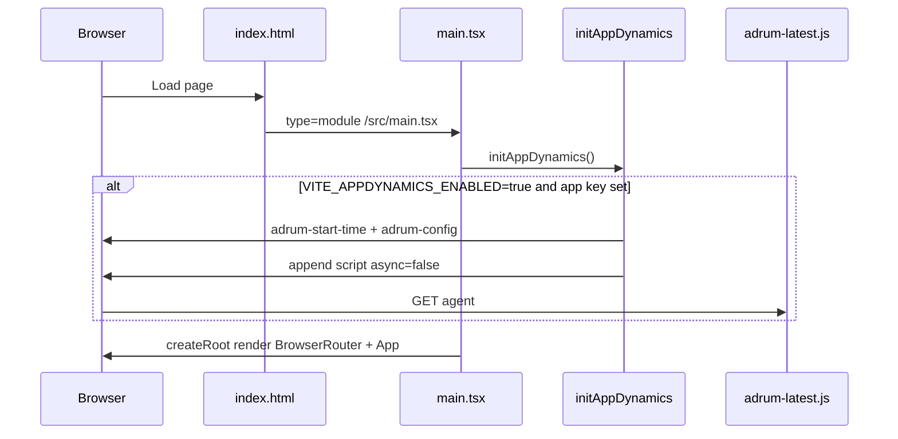

# Instrument a React Web Application with Splunk AppDynamics Browser RUM (Vite programmatic injection)

This guide documents a **Vite + React 18** e-commerce SPA pattern for **Splunk AppDynamics Browser Real User Monitoring (Browser RUM)**: programmatic injection of the JavaScript agent from a TypeScript module, env-driven configuration, and **SPA2** auto-instrumentation for React Router—without an ADRUM snippet in `index.html`.

> **Companion guide:** For the Splunk-recommended static `index.html` snippet path and a comparison of injection approaches, see [Instrument a React Web Application with Splunk AppDynamics Browser RUM](instrument-react-appdynamics-browser-rum.md).

> **Scope:** This document covers React **web** apps (Vite + React Router v6). For **React Native** mobile apps, use Mobile RUM instead. See [Instrument React Native Applications](https://help.splunk.com/en/appdynamics-saas/end-user-monitoring/26.5.0/end-user-monitoring/mobile-real-user-monitoring/instrument-react-native-applications).

## Requirements

| Requirement | Detail |
|---|---|
| AppDynamics SaaS account | Access to the Controller UI |
| Browser Application | Created under **End User Monitoring → Browser Monitoring** |
| EUM App Key | Generated in **Configuration → Configure JavaScript Agent** |
| JavaScript agent | SaaS: `adrum-latest.js` from the AppDynamics CDN (recommended) |
| SPA2 monitoring | `config.spa = { spa2: true }` — required for React auto-instrumentation |
| Agent version | JavaScript Agent >= 4.4.3; manual virtual-page naming API >= 4.5 |
| Vite entry module | `initObservability()` in `main.tsx` **before** `createRoot()` (dispatches to AppD or Splunk RUM) |

There is **no React-specific npm SDK** for web Browser RUM. This pattern uses manual injection via `window["adrum-config"]` and a dynamically appended `<script>` tag, plus optional calls to the global `ADRUM` API.

### SPA2 requirements (React)

From the official SPA2 documentation:

- JavaScript Agent >= 4.4.3
- Controller / EUM Server >= 4.4.3 (on-premises deployments)
- Set `spa2: true` in the agent config **before** loading `adrum-latest.js`
- The default for `spa2` is `false`; you must explicitly enable it for React

SPA2 provides auto-instrumentation for React (and other SPA frameworks), detecting route transitions via `history.pushState`, `history.replaceState`, and hash changes without manual virtual-page API calls in most cases.

## How to instrument

### 1. Create and configure the Browser Application (Controller UI)

1. In the Controller UI, open or create a **Browser Application**.
2. Go to **Configuration → Configure JavaScript Agent**.
3. Configure the agent (app key, beacon URLs, hosting options).
4. Enable **SPA2** monitoring in the configuration.
5. Save and copy the generated HTML snippet.

Use the Controller-generated snippet as the source of truth for `appKey`, `beaconUrlHttp`, `beaconUrlHttps`, and CDN URLs. SaaS deployments typically use:

- CDN: `cdn.appdynamics.com`
- Beacon: `col.eum-appdynamics.com`

Regional SaaS controllers may use a regional collector (for example `pdx-col.eum-appdynamics.com`). Copy beacon URLs from your Controller snippet into `VITE_APPDYNAMICS_BEACON_URL_*` rather than assuming the generic default.

### 2. Inject the JavaScript agent programmatically

This pattern loads the agent from `src/appdynamics/initAppDynamics.ts`, called at the top of `src/main.tsx` **before** React mounts. There is **no** AppDynamics script in `index.html`.

**Initialization flow:**



**Expected file layout:**

```
index.html                      # no ADRUM snippet
.env.example
src/
  vite-env.d.ts
  appdynamics/initAppDynamics.ts
  main.tsx
  App.tsx
  components/Layout.tsx         # layout wrapper for routes
  pages/HomePage.tsx
  pages/CartPage.tsx
  pages/PaymentPage.tsx
  context/CartContext.tsx       # app state (optional; shown in main.tsx)
```

**Implementation notes:**

- `import.meta.env` is **not** available in raw `index.html`; env vars drive this path.
- Dynamically inserted `<script>` elements default to `async`; set `script.async = false` so config is applied before the agent runs.
- Use an idempotent guard (`appDynamicsInitStarted`) to prevent double initialization during Vite HMR.
- Set `enableCoreWebVitals: true` when your agent version supports Core Web Vitals reporting.
- The EUM browser app key (`VITE_APPDYNAMICS_APP_KEY`) is separate from JVM APM credentials used by backend services.

#### `index.html`

No Browser RUM scripts—only the Vite module entry:

```html
<!DOCTYPE html>
<html lang="en">
  <head>
    <meta charset="UTF-8" />
    <meta name="viewport" content="width=device-width, initial-scale=1.0" />
    <title>My App</title>
    <link rel="preconnect" href="https://fonts.googleapis.com" />
    <link rel="preconnect" href="https://fonts.gstatic.com" crossorigin />
    <link
      href="https://fonts.googleapis.com/css2?family=DM+Sans:ital,opsz,wght@0,9..40,400;0,9..40,600;0,9..40,700;1,9..40,400&display=swap"
      rel="stylesheet"
    />
  </head>
  <body>
    <div id="root"></div>
    <script type="module" src="/src/main.tsx"></script>
  </body>
</html>
```

#### `src/appdynamics/initAppDynamics.ts`

```typescript
/**
 * Splunk AppDynamics — Browser Real User Monitoring (JavaScript agent) for a React SPA.
 *
 * For Vite + React **web** apps, use **Browser RUM**: manual injection of the JavaScript
 * agent with SPA2 enabled — not the React Native mobile agent.
 */

declare global {
  interface Window {
    "adrum-start-time"?: number;
    "adrum-config"?: Record<string, unknown>;
  }
}

let appDynamicsInitStarted = false;

function envTruthy(v: string | boolean | undefined): boolean {
  if (typeof v === "boolean") return v;
  return (v ?? "").trim().toLowerCase() === "true";
}

/**
 * Loads `adrum-latest.js` after setting `adrum-start-time` and `adrum-config`.
 * Enable with `VITE_APPDYNAMICS_ENABLED=true` and a non-empty `VITE_APPDYNAMICS_APP_KEY`
 * from the Controller Browser RUM instrumentation page.
 */
export function initAppDynamics(): void {
  if (appDynamicsInitStarted) return;
  const enabled = envTruthy(import.meta.env.VITE_APPDYNAMICS_ENABLED);
  const appKey = import.meta.env.VITE_APPDYNAMICS_APP_KEY?.trim();

  if (enabled && !appKey) {
    console.warn(
      "[AppDynamics Browser RUM] VITE_APPDYNAMICS_ENABLED is true but VITE_APPDYNAMICS_APP_KEY is empty, so the ADRUM script will not load. " +
        "Set the key in .env or .env.local and restart the dev server.",
    );
  }
  if (!enabled || !appKey) {
    return;
  }
  appDynamicsInitStarted = true;

  const adrumExtUrlHttps =
    import.meta.env.VITE_APPDYNAMICS_ADRUM_EXT_URL_HTTPS ?? "https://cdn.appdynamics.com";
  const adrumExtUrlHttp =
    import.meta.env.VITE_APPDYNAMICS_ADRUM_EXT_URL_HTTP ?? "http://cdn.appdynamics.com";
  const beaconUrlHttps =
    import.meta.env.VITE_APPDYNAMICS_BEACON_URL_HTTPS ?? "https://col.eum-appdynamics.com";
  const beaconUrlHttp =
    import.meta.env.VITE_APPDYNAMICS_BEACON_URL_HTTP ?? "http://col.eum-appdynamics.com";
  const agentScriptUrl =
    import.meta.env.VITE_APPDYNAMICS_AGENT_SCRIPT_URL ??
    "https://cdn.appdynamics.com/adrum/adrum-latest.js";
  const spa2 = import.meta.env.VITE_APPDYNAMICS_SPA2 !== "false";
  const xdEnable = import.meta.env.VITE_APPDYNAMICS_XD_ENABLE === "true";

  window["adrum-start-time"] = new Date().getTime();
  const cfg = (window["adrum-config"] = window["adrum-config"] ?? {});
  cfg.appKey = appKey;
  cfg.adrumExtUrlHttp = adrumExtUrlHttp;
  cfg.adrumExtUrlHttps = adrumExtUrlHttps;
  cfg.beaconUrlHttp = beaconUrlHttp;
  cfg.beaconUrlHttps = beaconUrlHttps;
  cfg.enableCoreWebVitals = true;
  cfg.xd = { enable: xdEnable };
  cfg.spa = { spa2 };

  const script = document.createElement("script");
  script.src = agentScriptUrl;
  script.charset = "UTF-8";
  script.type = "text/javascript";
  script.async = false;
  document.head.appendChild(script);
}
```

#### `src/main.tsx`

Call `initAppDynamics()` before `createRoot()`:

```tsx
import { StrictMode } from "react";
import { createRoot } from "react-dom/client";
import { BrowserRouter } from "react-router-dom";
import { initAppDynamics } from "@/appdynamics/initAppDynamics";
import { CartProvider } from "@/context/CartContext";
import { App } from "@/App";
import "@/index.css";

initAppDynamics();

createRoot(document.getElementById("root")!).render(
  <StrictMode>
    <BrowserRouter>
      <CartProvider>
        <App />
      </CartProvider>
    </BrowserRouter>
  </StrictMode>,
);
```

#### `src/vite-env.d.ts`

```typescript
/// <reference types="vite/client" />

interface ImportMetaEnv {
  readonly VITE_API_BASE_URL?: string;
  /** Set to `"true"` to load the Browser RUM JavaScript agent. */
  readonly VITE_APPDYNAMICS_ENABLED?: string;
  /** EUM / Browser application key from the Controller (never commit real values). */
  readonly VITE_APPDYNAMICS_APP_KEY?: string;
  readonly VITE_APPDYNAMICS_ADRUM_EXT_URL_HTTPS?: string;
  readonly VITE_APPDYNAMICS_ADRUM_EXT_URL_HTTP?: string;
  readonly VITE_APPDYNAMICS_BEACON_URL_HTTPS?: string;
  readonly VITE_APPDYNAMICS_BEACON_URL_HTTP?: string;
  readonly VITE_APPDYNAMICS_AGENT_SCRIPT_URL?: string;
  /** Default enabled; set to `"false"` to disable SPA2 auto-instrumentation. */
  readonly VITE_APPDYNAMICS_SPA2?: string;
  /** Cross-domain session; default false per Splunk SPA2 sample. */
  readonly VITE_APPDYNAMICS_XD_ENABLE?: string;
}

interface ImportMeta {
  readonly env: ImportMetaEnv;
}
```

#### `.env.example`

Copy to `.env` or `.env.local`. Do not commit real keys.

```bash
# User Experience > Browser RUM > your app > "Get your application key" / manual injection snippet.
# Do NOT commit real keys.

# Optional: prefix for API calls in production (dev uses Vite proxy when unset).
# VITE_API_BASE_URL=

# --- Browser RUM (JavaScript agent) — NOT the React Native mobile agent ---
VITE_APPDYNAMICS_ENABLED=false
VITE_APPDYNAMICS_APP_KEY=

# Override if your Controller snippet shows different hosts (SaaS region / on-prem).
# VITE_APPDYNAMICS_ADRUM_EXT_URL_HTTPS=https://cdn.appdynamics.com
# VITE_APPDYNAMICS_ADRUM_EXT_URL_HTTP=http://cdn.appdynamics.com
# VITE_APPDYNAMICS_BEACON_URL_HTTPS=https://col.eum-appdynamics.com
# VITE_APPDYNAMICS_BEACON_URL_HTTP=http://col.eum-appdynamics.com
# Regional example (copy from Controller snippet):
# VITE_APPDYNAMICS_BEACON_URL_HTTPS=<BEACON_URL_HTTPS>
# VITE_APPDYNAMICS_AGENT_SCRIPT_URL=https://cdn.appdynamics.com/adrum/adrum-latest.js

# SPA2 virtual page timing for this React SPA (Splunk default recommendation: true).
# VITE_APPDYNAMICS_SPA2=true
# VITE_APPDYNAMICS_XD_ENABLE=false
```

#### Enable locally (`.env.local` snippet)

```bash
VITE_APPDYNAMICS_ENABLED=true
VITE_APPDYNAMICS_APP_KEY=<EUM_APP_KEY>
# Optional — use values from your Controller snippet:
# VITE_APPDYNAMICS_BEACON_URL_HTTPS=<BEACON_URL_HTTPS>
# VITE_APPDYNAMICS_BEACON_URL_HTTP=<BEACON_URL_HTTP>
VITE_APPDYNAMICS_SPA2=true
```

```bash
cp .env.example .env.local
# Edit .env.local with values above
npm run dev   # restart after changing env files
```

#### Environment variables

| Variable | Default in code | Purpose |
|---|---|---|
| `VITE_APPDYNAMICS_ENABLED` | — | Master switch (`"true"` to load agent) |
| `VITE_APPDYNAMICS_APP_KEY` | — | EUM browser app key (required when enabled) |
| `VITE_APPDYNAMICS_BEACON_URL_HTTPS` | `https://col.eum-appdynamics.com` | Beacon collector (HTTPS) |
| `VITE_APPDYNAMICS_BEACON_URL_HTTP` | `http://col.eum-appdynamics.com` | Beacon collector (HTTP fallback) |
| `VITE_APPDYNAMICS_ADRUM_EXT_URL_HTTPS` | `https://cdn.appdynamics.com` | Agent extension CDN (HTTPS) |
| `VITE_APPDYNAMICS_ADRUM_EXT_URL_HTTP` | `http://cdn.appdynamics.com` | Agent extension CDN (HTTP) |
| `VITE_APPDYNAMICS_AGENT_SCRIPT_URL` | `https://cdn.appdynamics.com/adrum/adrum-latest.js` | Agent script URL; pin version only if required |
| `VITE_APPDYNAMICS_SPA2` | enabled unless `"false"` | SPA2 auto virtual pages |
| `VITE_APPDYNAMICS_XD_ENABLE` | `false` unless `"true"` | Cross-domain sessions |

Vite inlines `VITE_*` values at **build time** into the static bundle. Set env vars before `npm run build` for production.

#### What this pattern does and does not do

**Does:**

- Load the agent synchronously (`script.async = false`) before React mount
- Set `enableCoreWebVitals: true`, `spa: { spa2: true }`, and `xd: { enable: false }` by default
- Track route changes via SPA2 and `BrowserRouter` (`/`, `/cart`, `/payment`)

**Does not:**

- Inject ADRUM into `index.html`
- Use custom virtual page names or `ADRUM.report` business events
- Pass API session headers to ADRUM

### 3. SPA routing and virtual pages

#### Minimal path — SPA2 auto-instrumentation (used in this pattern)

With `config.spa = { spa2: true }`, the JavaScript agent auto-detects client-side navigations from React Router. No extra RUM code is required beyond `BrowserRouter` in `main.tsx` and routes in `App.tsx`:

```tsx
// src/App.tsx
import { Navigate, Route, Routes } from "react-router-dom";
import { Layout } from "@/components/Layout";
import { HomePage } from "@/pages/HomePage";
import { CartPage } from "@/pages/CartPage";
import { PaymentPage } from "@/pages/PaymentPage";

export function App() {
  return (
    <Routes>
      <Route element={<Layout />}>
        <Route index element={<HomePage />} />
        <Route path="cart" element={<CartPage />} />
        <Route path="payment" element={<PaymentPage />} />
        <Route path="*" element={<Navigate to="/" replace />} />
      </Route>
    </Routes>
  );
}
```

Custom virtual page names are **optional** when SPA2 is enabled.

#### Optional enhancement — custom virtual page names

For clearer Controller dashboards, set virtual page names that match your routes:

```tsx
// src/appd/AppDynamicsRouteTracker.tsx
import { useEffect } from "react";
import { useLocation } from "react-router-dom";

declare global {
  interface Window {
    ADRUM?: {
      setVirtualPageName?: (name: string) => void;
      command?: (cmd: string, name: string) => void;
    };
  }
}

export function AppDynamicsRouteTracker() {
  const { pathname } = useLocation();

  useEffect(() => {
    const pageName = pathname || "/";
    window.ADRUM?.command?.("setVirtualPageName", pageName);
  }, [pathname]);

  return null;
}
```

Mount inside `<BrowserRouter>` in `main.tsx` (before or alongside `<App />`).

Requirements for custom virtual page names:

- SPA2 must be enabled (`config.spa = { spa2: true }`).
- Names must be 760 or fewer alphanumeric characters.
- Call `ADRUM.command("setVirtualPageName", ...)` or `ADRUM.setVirtualPageName(...)` after navigations the agent can track.

For manual virtual-page boundaries (rare with SPA2 + React Router), use `ADRUM.markVirtualPageBegin()` and `ADRUM.markVirtualPageEnd()` as documented in the JavaScript Agent API.

### 4. Disable monitoring in local or dev builds

Leave `VITE_APPDYNAMICS_ENABLED=false` in `.env.example` (default off). The agent script is **not loaded at all** in dev unless you explicitly set:

```bash
VITE_APPDYNAMICS_ENABLED=true
VITE_APPDYNAMICS_APP_KEY=<EUM_APP_KEY>
```

Restart the Vite dev server after changing env files. No `adrum-disable` flag is needed because the init function returns early when disabled.

For production builds, omit or set `VITE_APPDYNAMICS_ENABLED=false` in the env file used at build time to exclude the agent from the bundle behavior (the init function still runs but exits immediately if disabled or key is missing).

### 5. Verify instrumentation

After enabling locally or deploying, confirm monitoring is active:

1. **DevTools → Elements / Network:** Confirm `adrum-latest.js` was appended to `<head>` and beacon requests are sent to your configured collector.
2. **DevTools → Network:** Look for requests to `col.eum-appdynamics.com` or your regional host (for example `<BEACON_URL_HTTPS>` such as `https://pdx-col.eum-appdynamics.com`).
3. **DevTools → Console:** If `VITE_APPDYNAMICS_ENABLED=true` but the app key is empty, expect a `[AppDynamics Browser RUM]` warning and no agent load.
4. **Controller → Browser Application dashboard:** Allow a few minutes after first traffic for metrics to appear.
5. **Navigate between routes:** Browse `/` → `/cart` → `/payment` and confirm virtual pages appear in Browser RUM views.

**If no data appears, check:**

- `VITE_APPDYNAMICS_ENABLED=false` or missing app key
- App key matches the **Browser Application** in Controller (not the React Native or JVM agent key)
- Beacon URL matches your Controller snippet (wrong region is a common misconfiguration)
- Ad blockers or corporate proxies blocking `*.eum-appdynamics.com`
- Env vars were set **before** `npm run build` (Vite inlines them at compile time)

Review the troubleshooting guide linked in Sources for additional steps.

## Best practices

1. **Use SPA2 for React.** SPA2 auto-instruments React route transitions. SPA1 (AngularJS 1 only) is not suitable for React.
2. **Load the agent synchronously.** Set `script.async = false` on the dynamically inserted script tag.
3. **Call `initAppDynamics()` before React.** Invoke it at the top of `main.tsx`, before `createRoot().render(...)`.
4. **Prefer Controller snippet values** for beacon and CDN URLs—regional collectors differ from generic SaaS defaults.
5. **Enable Core Web Vitals** with `enableCoreWebVitals: true` when supported by your agent version.
6. **Keep secrets in env files.** Never hardcode `VITE_APPDYNAMICS_APP_KEY` in source; use `.env.local` (gitignored) for local dev.
7. **Do not disable Fetch monitoring for React.** Avoid `config.fetch = false`; Fetch API calls are monitored by default for non-Angular SPAs.
8. **Use separate Browser Applications per environment** with distinct EUM app keys.
9. **Disable locally with `VITE_APPDYNAMICS_ENABLED=false`** instead of loading the agent and suppressing beacons.
10. **Plan for Content-Security-Policy (CSP).** Allow the AppDynamics CDN and dynamically loaded script sources if CSP is enforced.
11. **Do not use this guide for React Native.** Mobile apps require the separate React Native EUM agent, not the browser JavaScript agent.

## Sources

Each URL was verified with HTTP GET on 2026-06-10. Only URLs returning **HTTP 200** are listed; all others are marked **No provided**.

| Topic | Source |
|---|---|
| Browser Monitoring overview | https://help.splunk.com/en/appdynamics-saas/end-user-monitoring/26.5.0/end-user-monitoring/browser-monitoring |
| Configure the JavaScript Agent | https://help.splunk.com/en/appdynamics-saas/end-user-monitoring/26.5.0/end-user-monitoring/browser-monitoring/browser-real-user-monitoring/configure-the-javascript-agent |
| Inject the JavaScript Agent | https://help.splunk.com/en/appdynamics-saas/end-user-monitoring/26.5.0/end-user-monitoring/browser-monitoring/browser-real-user-monitoring/inject-the-javascript-agent |
| Manual Injection of the JavaScript Agent | https://help.splunk.com/en/appdynamics-saas/end-user-monitoring/26.5.0/end-user-monitoring/browser-monitoring/browser-real-user-monitoring/inject-the-javascript-agent/manual-injection-of-the-javascript-agent |
| Monitor Single-Page Applications | https://help.splunk.com/en/appdynamics-saas/end-user-monitoring/26.5.0/end-user-monitoring/browser-monitoring/browser-real-user-monitoring/monitor-single-page-applications |
| SPA2 Monitoring | https://help.splunk.com/en/appdynamics-saas/end-user-monitoring/26.5.0/end-user-monitoring/browser-monitoring/browser-real-user-monitoring/monitor-single-page-applications/spa2-monitoring |
| Configure SPA2 Monitoring | https://help.splunk.com/en/appdynamics-saas/end-user-monitoring/26.5.0/end-user-monitoring/browser-monitoring/browser-real-user-monitoring/monitor-single-page-applications/spa2-monitoring/configure-spa2-monitoring |
| Set Custom Virtual Page Names | https://help.splunk.com/en/appdynamics-saas/end-user-monitoring/26.5.0/end-user-monitoring/browser-monitoring/browser-real-user-monitoring/configure-the-javascript-agent/set-custom-virtual-page-names |
| Disable Browser Monitoring Programmatically | https://help.splunk.com/en/appdynamics-saas/end-user-monitoring/26.5.0/end-user-monitoring/browser-monitoring/browser-real-user-monitoring/configure-the-javascript-agent/disable-browser-monitoring-programmatically |
| Enable the Content Security Policy (CSP) | https://help.splunk.com/en/appdynamics-saas/end-user-monitoring/26.5.0/end-user-monitoring/browser-monitoring/browser-real-user-monitoring/enable-the-content-security-policy-csp |
| Hide URL Query Strings | https://help.splunk.com/en/appdynamics-saas/end-user-monitoring/26.5.0/end-user-monitoring/browser-monitoring/browser-real-user-monitoring/configure-the-javascript-agent/hide-all-or-parts-of-the-url-query-string |
| Troubleshoot Browser RUM | https://help.splunk.com/en/appdynamics-saas/end-user-monitoring/26.5.0/end-user-monitoring/browser-monitoring/browser-real-user-monitoring/troubleshoot-browser-rum |
| Instrument React Native Applications (mobile — not web) | https://help.splunk.com/en/appdynamics-saas/end-user-monitoring/26.5.0/end-user-monitoring/mobile-real-user-monitoring/instrument-react-native-applications |
| CSP under Configure JavaScript Agent (nested path) | No provided |
