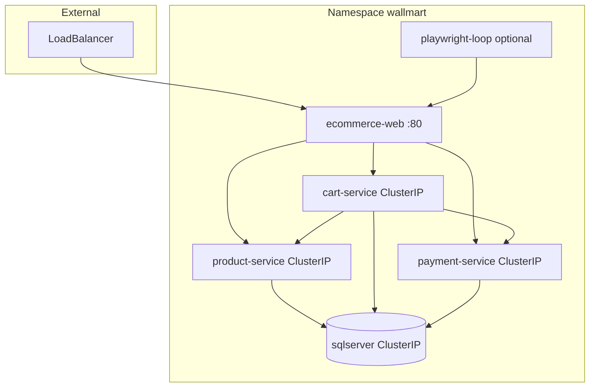

# Phase 2 — Helm Chart (`k8s/wallmart-ecommerce/`)

Deploy the FreshMart ecommerce demo on generic Kubernetes using a Helm chart: SQL Server, three Spring Boot services, nginx web front-end, and an optional Playwright synthetic loop. No AppDynamics agents.

## Implementation checklist

- [x] Create `k8s/wallmart-ecommerce/` chart scaffold (`Chart.yaml`, `values.yaml`, `values-local.example.yaml`, `_helpers.tpl`, `.helmignore`)
- [x] Templates: sqlserver StatefulSet + Service + PVC
- [x] Templates: product / cart / payment Deployment + Service (ClusterIP)
- [x] Templates: nginx ConfigMap, ecommerce-web Deployment/Service (**LoadBalancer** default)
- [x] Template: playwright-loop Deployment (`synthetic.enabled`)
- [x] Write `k8s/README.md` with helm install/upgrade/uninstall steps

---

## Public access: LoadBalancer, not Ingress

**Default:** `ecommerce-web` Service `type: LoadBalancer` — one external IP/hostname for the whole app.

nginx inside that pod already routes `/productsearch`, `/checkout`, `/pay`, etc. to internal ClusterIP services ([docker/web/nginx.conf](../docker/web/nginx.conf)). Ingress would add an extra hop and controller dependency without benefit for this single-front-end layout.

| `ecommerceWeb.service.type` | Use when |
|-----------------------------|----------|
| **LoadBalancer** (default) | EKS, GKE, AKS, any cloud with LB provisioner |
| **ClusterIP** | kind/minikube — pair with `kubectl port-forward svc/ecommerce-web 8080:80` |
| **NodePort** | bare-metal / no cloud LB |

`ingress.enabled` stays **false** by default; optional fallback only.

---

## Architecture



---

## Key `values.yaml` sections

| Section | Purpose |
|---------|---------|
| `ecommerceWeb.service.type` | `LoadBalancer` (default), `ClusterIP`, or `NodePort` |
| `ecommerceWeb.service.port` | `80` |
| `ingress.enabled` | `false` by default |
| `global.imageRegistry` / `imageTag` | Image registry and tag |
| `mssql.password` | Set at install via `--set` (never commit) |
| `synthetic.enabled` | Playwright loop on/off |

---

## Install example

```bash
helm upgrade --install wallmart ./k8s/wallmart-ecommerce \
  --namespace wallmart --create-namespace \
  --set global.imageRegistry=your-registry \
  --set mssql.password='YourStrong!Passw0rd' \
  --set synthetic.enabled=true

kubectl get svc ecommerce-web -n wallmart   # EXTERNAL-IP
```

Local cluster (no LoadBalancer):

```bash
helm upgrade --install wallmart ./k8s/wallmart-ecommerce \
  --set ecommerceWeb.service.type=ClusterIP ...
kubectl port-forward svc/ecommerce-web 8080:80 -n wallmart
```

---

## Out of scope

- AppDynamics agents
- Ingress controller (unless `ingress.enabled: true`)
- OpenShift Routes
